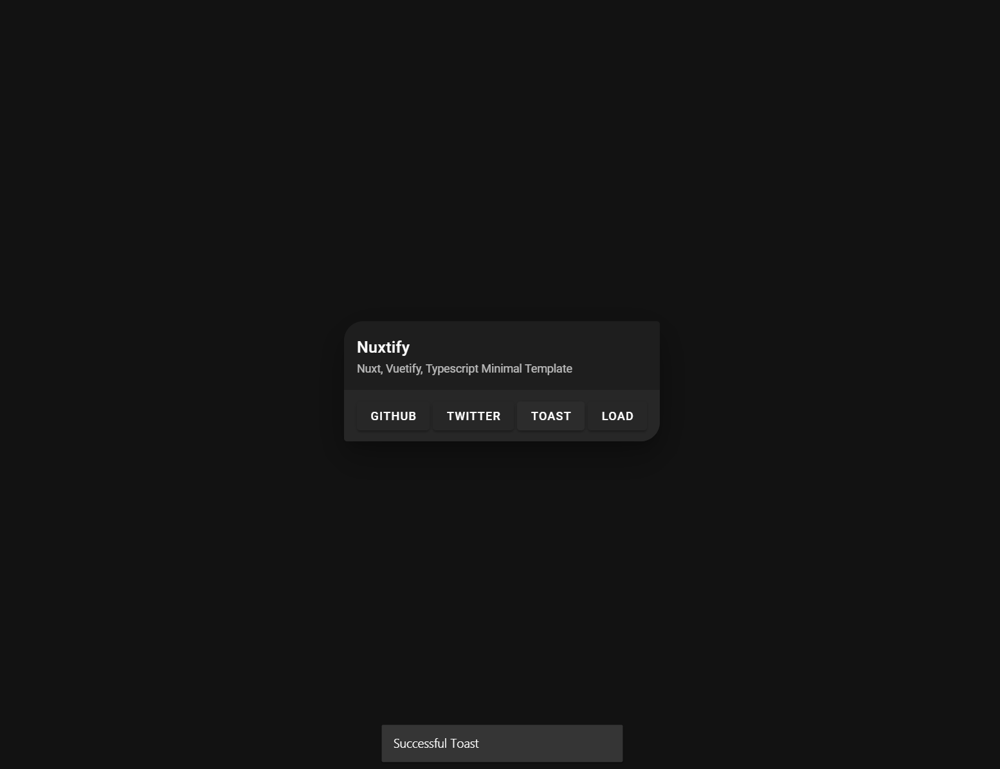
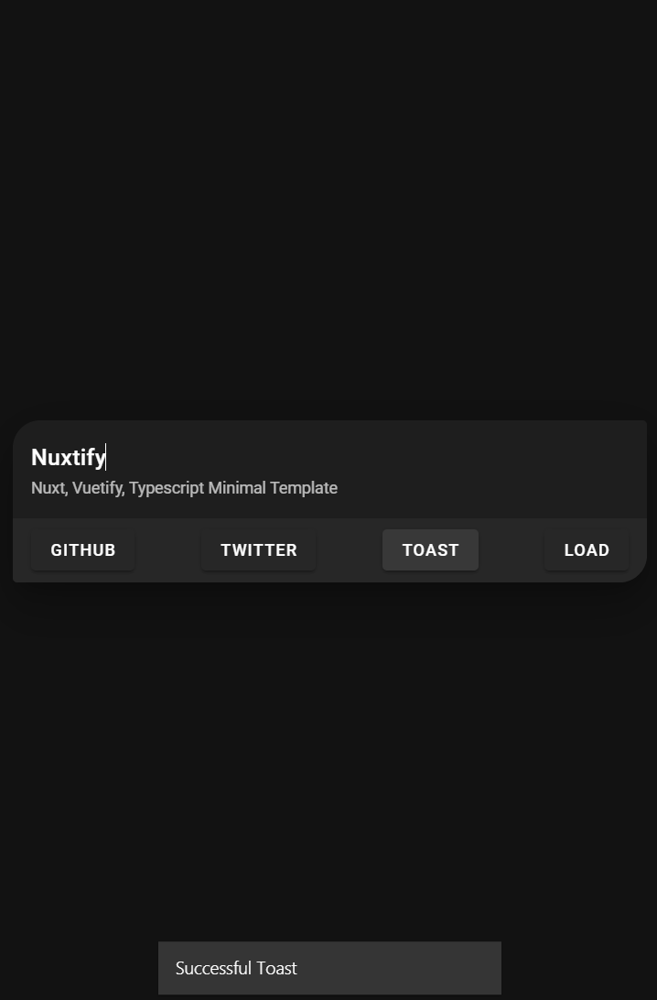
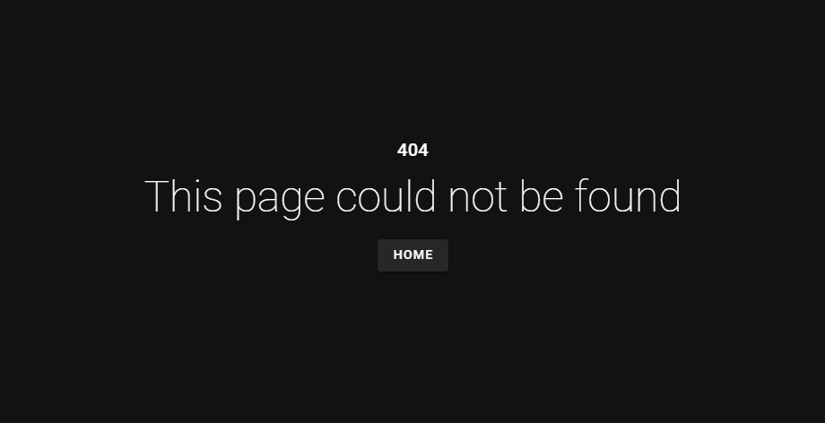

# Minimal Nuxt TS Template
- [Github Action Demo](https://seonglae.github.io/nuxtify)
- [Vercel Demo](https://nuxtify.vercel.app)

## Get Started

```bash
git clone https://github.com/seonglae/nuxtify
yarn
yarn dev
```

## Components
- Toast Snackbar
- Loading
- Error Page

### Desktop View


### Mobile View


### Error View


### Modules

- Vuetify
- Vuex
- Axios
- Vue Composition API


### Configs

- SEO Options
- Optimize Options

### Develop Tools

- nodemon
- Prettier
- Github Action
  - Build Pipeline - CI
  - Github Page - CD

## Philosophy

- Atomic Design Pattern
- Minimalism

## Examples

- [Pointland](point.seongland.com) - [Repository](github.com/seongland/pointland)
